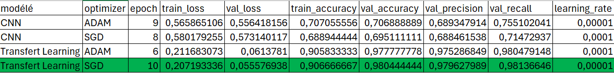
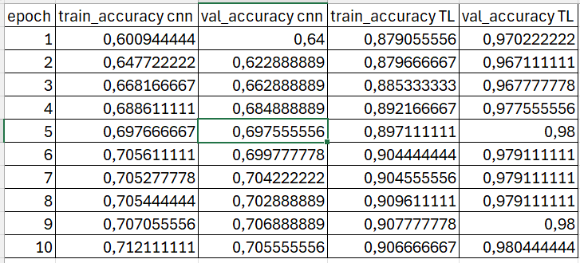
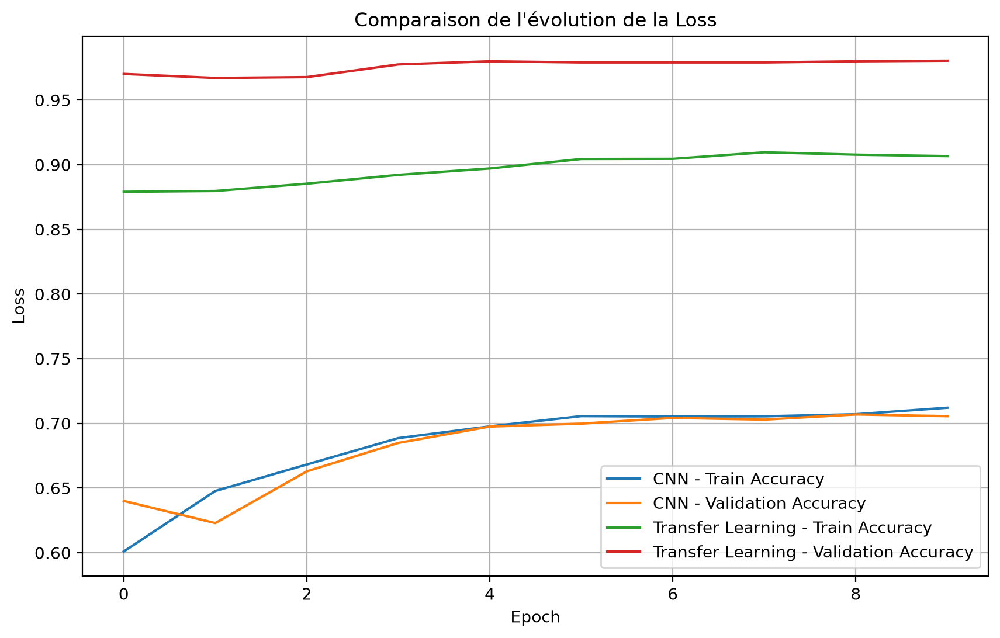
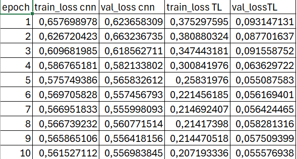
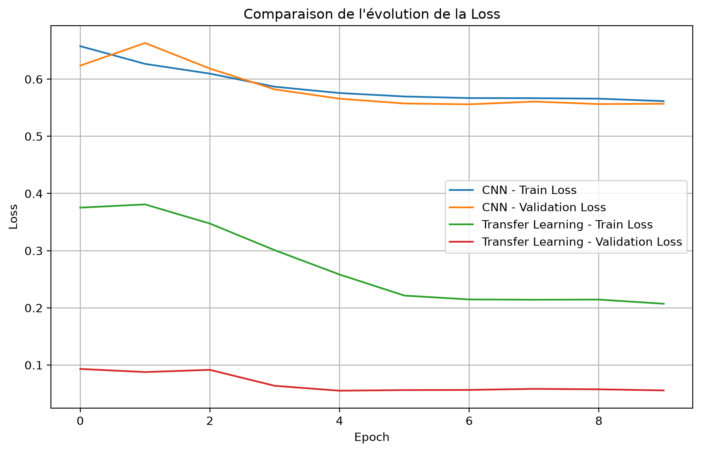
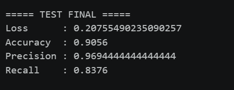
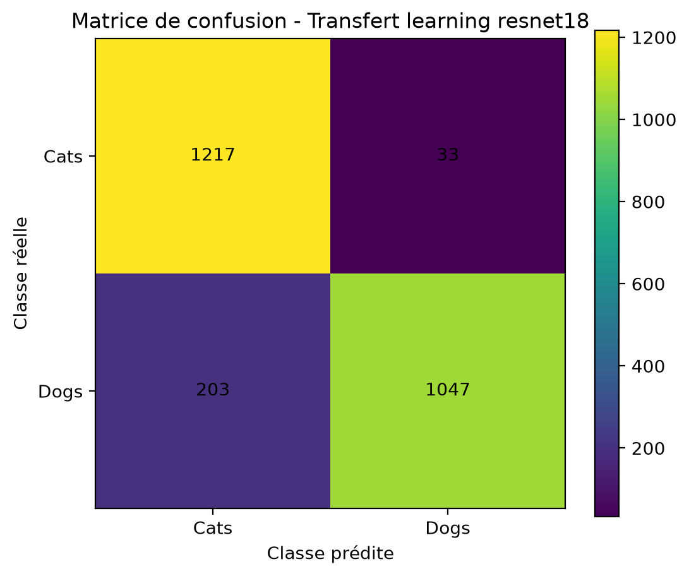

# CNN From Scratch vs Transfer Learning — Cats vs Dogs

## Présentation du projet

Ce projet a été réalisé dans le cadre du cours **Deep Learning 1** du Master Intelligence Artificielle.

L'objectif est de développer et de comparer deux approches de classification d'images sur le jeu de données **Cats vs Dogs** avec **PyTorch** :

1. un réseau de neurones convolutif développé **from scratch** ;
2. une approche de **Transfer Learning** basée sur **ResNet18 pré-entraîné sur ImageNet**.

Pour chaque approche, deux optimiseurs sont étudiés :

* Adam ;
* SGD avec momentum.

Les expériences permettent d'étudier l'influence de l'architecture et de l'optimiseur sur l'apprentissage et les performances de classification.

Les principales métriques suivies sont :

* Loss ;
* Accuracy ;
* Precision ;
* Recall.

Des courbes d'apprentissage et des matrices de confusion sont également utilisées pour analyser les résultats.

---

#  Objectifs

Les objectifs du projet sont les suivants :

* construire un CNN avec au moins trois blocs convolutionnels ;
* utiliser Batch Normalization et Dropout pour régulariser le modèle ;
* entraîner le CNN from scratch ;
* utiliser ResNet18 pré-entraîné sur ImageNet ;
* adapter la dernière couche de ResNet18 à la classification Cats vs Dogs ;
* comparer Adam et SGD ;
* utiliser un scheduler pour adapter le learning rate ;
* sauvegarder les meilleurs modèles sous forme de checkpoints `.pth` ;
* recharger les meilleurs modèles pour l'évaluation finale ;
* comparer les performances des différentes configurations.

---

---
## Récapitulatif de la methodologie

### 1. Préparation de l’environnement

* Création de l’environnement virtuel.
* Activation de l’environnement virtuel.
* Définition de l’environnement virtuel comme kernel Jupyter.
* Création du fichier `requirements.txt`.
* Installation des bibliothèques à partir de `requirements.txt`.

### 2. Initialisation du projet

* Importation des bibliothèques nécessaires.
* Configuration des répertoires pour :

  * les checkpoints ;
  * les figures ;
  * les historiques.
* Fixation du `seed = 42` pour assurer la reproductibilité.
* Détection du `device` : GPU CUDA si disponible, sinon CPU.

### 3. Préparation des données

* Chargement des données d’entraînement et de test.
* Séparation des données d’entraînement en :

  * données d’entraînement ;
  * données de validation.
* Utilisation du même `seed` pour garantir un split reproductible.
* Sauvegarde des indices des données d’entraînement et de validation.
* Application des transformations :

  * augmentation des données pour l’entraînement ;
  * pas d’augmentation pour la validation et le test.

### 4. CNN From Scratch

* Construction de l’architecture CNN.
* Utilisation de :

  * 3 blocs convolutionnels ;
  * Batch Normalization ;
  * MaxPooling ;
  * Dropout de 50 %.
* Définition de la fonction de perte.
* Définition du scheduler.

### 5. Entraînement du CNN avec Adam

* Définition de l’optimiseur Adam.
* Entraînement pendant 10 epochs.
* À chaque epoch :

  * calcul de la loss et de l’accuracy sur les données d’entraînement ;
  * calcul de la loss, de l’accuracy, de la précision et du recall sur les données de validation.
* Comparaison avec le meilleur résultat obtenu jusque-là.
* Sauvegarde du meilleur modèle dans `BEST.pth`.
* Sauvegarde du dernier état du modèle dans `LAST.pth`.
* Enregistrement de l’historique des métriques dans un fichier Excel.

### 6. Entraînement du CNN avec SGD

* Définition de l’optimiseur SGD.
* Utilisation du même processus d’entraînement.
* Entraînement pendant 10 epochs.
* Calcul des métriques sur les données d’entraînement et de validation à chaque epoch.
* Sauvegarde du meilleur modèle dans `BEST.pth`.
* Sauvegarde du dernier état du modèle dans `LAST.pth`.
* Enregistrement de l’historique des métriques dans un fichier Excel.
* Comparaison des résultats du CNN avec Adam et avec SGD.
* Sélection du meilleur CNN selon l’accuracy de validation.

### 7. Transfer Learning avec ResNet18

* Utilisation du même dataset.
* Réutilisation du même split entraînement/validation.
* Utilisation des indices précédemment sauvegardés.
* Ajout de la normalisation ImageNet aux transformations.
* Chargement de ResNet18 pré-entraîné sur ImageNet.
* Remplacement de la couche finale pour effectuer une classification à 2 classes :

  * Chat ;
  * Chien.
* Ajout de :

  * Batch Normalization ;
  * Dropout de 50 %.
* Gel des couches pré-entraînées de ResNet18.
* Entraînement uniquement de la nouvelle couche finale.

### 8. Entraînement de ResNet18 avec Adam

* Définition de la fonction de perte.
* Définition de l’optimiseur Adam.
* Définition du scheduler.
* Entraînement pendant 10 epochs.
* Calcul des métriques sur les données d’entraînement et de validation.
* Sauvegarde du meilleur modèle dans `BEST.pth`.
* Sauvegarde du dernier état du modèle dans `LAST.pth`.
* Enregistrement de l’historique des métriques dans un fichier Excel.

### 9. Entraînement de ResNet18 avec SGD

* Définition de l’optimiseur SGD.
* Utilisation du même processus d’entraînement.
* Entraînement pendant 10 epochs.
* Calcul des métriques sur les données d’entraînement et de validation.
* Sauvegarde du meilleur modèle dans `BEST.pth`.
* Sauvegarde du dernier état du modèle dans `LAST.pth`.
* Enregistrement de l’historique des métriques dans un fichier Excel.
* Comparaison des résultats de ResNet18 avec Adam et avec SGD.
* Sélection du meilleur ResNet18 selon l’accuracy de validation.

### 10. Comparaison CNN vs Transfer Learning

* Comparaison des deux meilleures configurations obtenues.
* Construction des courbes de loss :

  * entraînement ;
  * validation.
* Construction des courbes d’accuracy :

  * entraînement ;
  * validation.
* Analyse des performances du CNN et de ResNet18.
* Comparaison de la convergence des deux approches.

### 11. Évaluation finale

* Sélection du meilleur modèle.
* Rechargement du checkpoint sauvegardé.
* Évaluation du modèle sur les données de test.
* Calcul des métriques :

  * loss ;
  * accuracy ;
  * précision ;
  * recall.
* Construction de la matrice de confusion.
* Analyse des erreurs de classification.
---

# Environnement

## 3.1 Technologies utilisées

Le projet utilise :

* Python 3.12 ;
* PyTorch ;
* Torchvision ;
* NumPy ;
* Matplotlib ;
* Scikit-learn ;
* Pandas ;
* Jupyter Notebook ;
* Google Colab / GPU CUDA lorsque disponible.

## Installation

Les dépendances nécessaires sont regroupées dans le fichier :

```text
requirements.txt
```

Pour installer les dépendances :

```bash
pip install -r requirements.txt
```

---

#  Utilisation du GPU

Le programme détecte automatiquement le périphérique disponible :

```python
device = torch.device(
    "cuda" if torch.cuda.is_available() else "cpu"
)

print("Device utilisé :", device)
```

Si un GPU CUDA est disponible, les modèles sont entraînés sur GPU.

Sinon, l'entraînement est effectué sur CPU.

---

## Structure du projet

```text
│   .gitignore
│   base_history_metriques_adam_train_val.xlsx
│   base_history_metriques_sgd_train_val.xlsx
│   base_history_metriques_tl_adam_train_val.xlsx
│   base_history_metriques_tl_sgd_train_val.xlsx
│   comparaison-cnn-tl.xlsx
│   notebook.ipynb
│   README.md
│   requirements.txt
│
├───checkpoints
│       resnet18_best_adam.pth
│       resnet18_best_sgd.pth
│       resnet18_last_adam.pth
│       resnet18_last_sgd.pth
│       scratch_cnn_best_adam.pth
│       scratch_cnn_best_sgd.pth
│       scratch_cnn_last_adam.pth
│       scratch_cnn_last_sgd.pth
│
├───data
│   ├───test
│   │   ├───cat
│   │   └───dog
│   └───train
│       ├───cat
│       └───dog
│
├───figures
│       comparaison_cnn_tl.png
│       evaluation_accuracy_cnn_tl.png
│       evaluation_loss_cnn_tl.png
│       historiques_entrainement_cnn.png
│       historiques_entrainement_tl.png
│       historique_accuracy_cnn_tl.png
│       historique_loss_cnn_tl.png
│       matrice_confusion.png
│       metriques_test.png
```

### Description des fichiers et répertoires

* `notebook.ipynb` : notebook principal contenant le code du projet, de la préparation des données jusqu'à l'évaluation finale.

* `requirements.txt` : liste des bibliothèques Python nécessaires pour exécuter le projet.

* `README.md` : documentation du projet, de la méthodologie et des résultats.

* `.gitignore` : fichiers et répertoires exclus du suivi Git.

### Dossier `data/`

Contient les données utilisées pour l'entraînement et l'évaluation :

* `data/train/cat/` : images de chats destinées à l'entraînement et à la validation.
* `data/train/dog/` : images de chiens destinées à l'entraînement et à la validation.
* `data/test/cat/` : images de chats destinées au test final.
* `data/test/dog/` : images de chiens destinées au test final.

### Dossier `checkpoints/`

Contient les modèles sauvegardés pendant les entraînements :

* `scratch_cnn_best_adam.pth` : meilleur modèle CNN entraîné avec Adam.
* `scratch_cnn_best_sgd.pth` : meilleur modèle CNN entraîné avec SGD.
* `scratch_cnn_last_adam.pth` : dernier état du CNN entraîné avec Adam.
* `scratch_cnn_last_sgd.pth` : dernier état du CNN entraîné avec SGD.
* `resnet18_best_adam.pth` : meilleur modèle ResNet18 entraîné avec Adam.
* `resnet18_best_sgd.pth` : meilleur modèle ResNet18 entraîné avec SGD.
* `resnet18_last_adam.pth` : dernier état de ResNet18 entraîné avec Adam.
* `resnet18_last_sgd.pth` : dernier état de ResNet18 entraîné avec SGD.

Les fichiers `best` permettent de recharger le meilleur modèle obtenu selon l'accuracy de validation.

Les fichiers `last` permettent de reprendre l'entraînement à partir du dernier état sauvegardé.

### Dossier `figures/`

Contient les graphiques générés pendant l'analyse :

* `comparaison_cnn_tl.png` : comparaison globale entre le CNN et le Transfer Learning.
* `evaluation_accuracy_cnn_tl.png` : comparaison des accuracy.
* `evaluation_loss_cnn_tl.png` : comparaison des loss.
* `historiques_entrainement_cnn.png` : historiques d'entraînement du CNN.
* `historiques_entrainement_tl.png` : historiques d'entraînement du Transfer Learning.
* `historique_accuracy_cnn_tl.png` : évolution de l'accuracy du CNN et du Transfer Learning.
* `historique_loss_cnn_tl.png` : évolution de la loss du CNN et du Transfer Learning.
* `matrice_confusion.png` : matrice de confusion obtenue sur les données de test.
* `metriques_test.png` : représentation graphique des métriques obtenues sur le test.

### Fichiers Excel

Les fichiers Excel contiennent les historiques des métriques calculées pendant les entraînements :

* `base_history_metriques_adam_train_val.xlsx` : historique du CNN avec Adam.
* `base_history_metriques_sgd_train_val.xlsx` : historique du CNN avec SGD.
* `base_history_metriques_tl_adam_train_val.xlsx` : historique de ResNet18 avec Adam.
* `base_history_metriques_tl_sgd_train_val.xlsx` : historique de ResNet18 avec SGD.
* `comparaison-cnn-tl.xlsx` : comparaison des performances des différentes configurations.
---

# Organisation des données

Les données sont placées dans le dossier :

```text
data/
```

avec l'organisation suivante :

```text
data/
├── train/
│   ├── cat/
│   └── dog/
│
└── test/
    ├── cat/
    └── dog/
```

Le jeu de données est chargé avec `ImageFolder`.

Les classes sont automatiquement identifiées :

```text
cat → 0
dog → 1
```

---

# Configuration des chemins

Les chemins du projet sont définis automatiquement à partir du répertoire courant :

```python
import os

BASE_DIR = os.getcwd()

DATA_DIR = os.path.join(
    BASE_DIR,
    "data"
)

CHECKPOINT_DIR = os.path.join(
    BASE_DIR,
    "checkpoints"
)

FIGURES_DIR = os.path.join(
    BASE_DIR,
    "figures"
)

os.makedirs(
    CHECKPOINT_DIR,
    exist_ok=True
)

os.makedirs(
    FIGURES_DIR,
    exist_ok=True
)

print("Projet :", BASE_DIR)
print("Données :", DATA_DIR)
print("Checkpoints :", CHECKPOINT_DIR)
print("Figures :", FIGURES_DIR)
```

Cette organisation permet d'éviter d'utiliser des chemins absolus dépendant de l'ordinateur utilisé.

---

# Jeu de données

Le jeu de données contient :

| Ensemble      | Nombre d'images |
| ------------- | --------------: |
| Train initial |          18 008 |
| Train         |          14 406 |
| Validation    |           3 602 |
| Test          |           2 500 |

Le jeu d'entraînement est divisé en :

* 80 % pour l'entraînement ;
* 20 % pour la validation.

Le jeu de test est conservé séparément et n'est pas utilisé pendant l'entraînement.

Le même découpage est utilisé pour :

* CNN from scratch ;
* CNN avec Adam ;
* CNN avec SGD ;
* Transfer Learning avec Adam ;
* Transfer Learning avec SGD.

Cela permet de comparer les expériences dans des conditions identiques.

---

# Reproductibilité

Une graine aléatoire fixe est utilisée :

```python
SEED = 42

torch.manual_seed(SEED)
np.random.seed(SEED)

if torch.cuda.is_available():
    torch.cuda.manual_seed_all(SEED)
```

Le découpage entraînement/validation utilise également cette graine :

```python
split_generator = torch.Generator().manual_seed(SEED)

indices = torch.randperm(
    len(full_train_aug),
    generator=split_generator
)
```

Cette configuration permet d'obtenir le même découpage des données lors des différentes expériences.

---

# Prétraitement et augmentation

Les images sont redimensionnées à :

```text
224 × 224 pixels
```

Le batch utilisé est :

```text
32 images
```

## Transformation pour l'entraînement

Les images utilisées pour l'entraînement subissent les transformations suivantes :

```python
train_transforms = transforms.Compose([
    transforms.RandomRotation(30),
    transforms.RandomResizedCrop(224),
    transforms.RandomHorizontalFlip(),
    transforms.ToTensor()
])
```

Les transformations permettent de créer des variations des images originales et de réduire le risque de surapprentissage.

## Transformation pour la validation et le test

```python
val_test_transforms = transforms.Compose([
    transforms.Resize((224, 224)),
    transforms.ToTensor()
])
```

Aucune augmentation aléatoire n'est appliquée à la validation ou au test.

---

# Normalisation pour le Transfer Learning

Pour ResNet18, une normalisation correspondant aux statistiques d'ImageNet est utilisée :

```python
IMAGENET_MEAN = [
    0.485,
    0.456,
    0.406
]

IMAGENET_STD = [
    0.229,
    0.224,
    0.225
]
```

Les transformations sont :

```python
train_transforms_tl = transforms.Compose([
    transforms.RandomRotation(30),
    transforms.RandomResizedCrop(224),
    transforms.RandomHorizontalFlip(),
    transforms.ToTensor(),
    transforms.Normalize(
        mean=IMAGENET_MEAN,
        std=IMAGENET_STD
    )
])
```

Pour la validation et le test :

```python
val_test_transforms_tl = transforms.Compose([
    transforms.Resize((224, 224)),
    transforms.ToTensor(),
    transforms.Normalize(
        mean=IMAGENET_MEAN,
        std=IMAGENET_STD
    )
])
```

Cette normalisation permet de conserver un prétraitement compatible avec celui utilisé lors du pré-entraînement de ResNet18 sur ImageNet.

---

# Expérience 1 — CNN From Scratch

## Architecture

Le modèle `ScratchCNN` est construit entièrement avec PyTorch.

Il comporte trois blocs convolutionnels :

```text
Input
  │
  ▼
Conv2D 3 → 32
BatchNorm
ReLU
MaxPooling
  │
  ▼
Conv2D 32 → 64
BatchNorm
ReLU
MaxPooling
  │
  ▼
Conv2D 64 → 128
BatchNorm
ReLU
MaxPooling
  │
  ▼
Adaptive Average Pooling
  │
  ▼
Linear 128 → 256
ReLU
Dropout 0.5
  │
  ▼
Linear 256 → 2
  │
  ▼
Cat / Dog
```

Cette architecture respecte la contrainte d'avoir au minimum trois blocs convolutionnels.

---

# Régularisation du CNN

Deux techniques de régularisation sont utilisées.

## Batch Normalization

Chaque bloc convolutionnel utilise une couche Batch Normalization.

```python
nn.BatchNorm2d(...)
```

Elle permet notamment de stabiliser l'apprentissage et d'améliorer la convergence.

## Dropout

Une couche Dropout de taux 0.5 est utilisée avant la dernière couche :

```python
nn.Dropout(0.5)
```

Elle permet de réduire le risque de surapprentissage.

---

# Paramètres du CNN

Les principaux paramètres utilisés sont :

| Paramètre           |           Valeur |
| ------------------- | ---------------: |
| Architecture        |       ScratchCNN |
| Image size          |        224 × 224 |
| Batch size          |               32 |
| Epochs              |               10 |
| Dropout             |              0.5 |
| Batch Normalization |              Oui |
| Loss                | CrossEntropyLoss |
| Seed                |               42 |
| Scheduler           |           StepLR |
| Step size           |                3 |
| Gamma               |              0.1 |

Deux expériences sont réalisées avec le CNN :

* CNN + Adam ;
* CNN + SGD.

---

# Optimisation du CNN

## Adam

```python
optimizer_adam = optim.Adam(
    model.parameters(),
    lr=0.001
)
```

Configuration :

```text
Learning rate = 0.001
```

## SGD

```python
optimizer_sgd = optim.SGD(
    model.parameters(),
    lr=0.01,
    momentum=0.9
)
```

Configuration :

```text
Learning rate = 0.01
Momentum = 0.9
```

---

# Scheduler

Le scheduler utilisé est `StepLR` :

```python
scheduler = optim.lr_scheduler.StepLR(
    optimizer,
    step_size=3,
    gamma=0.1
)
```

Le learning rate est réduit d'un facteur 10 tous les trois epochs.

---

# Fonction de perte

La fonction de perte utilisée est :

```python
criterion = nn.CrossEntropyLoss()
```

Elle est adaptée à la classification des deux classes :

```text
cat
dog
```

La même fonction de perte est utilisée pour le CNN et le Transfer Learning.

---

# Expérience 2 — Transfer Learning

## ResNet18

Le deuxième modèle est basé sur ResNet18 pré-entraîné sur ImageNet :

```python
model_tl = models.resnet18(
    weights=models.ResNet18_Weights.DEFAULT
)
```

Le pré-entraînement permet d'exploiter des représentations visuelles apprises sur ImageNet.

---

# Adaptation de ResNet18

La couche de classification originale est remplacée par une nouvelle tête :

```python
n_features = model_tl.fc.in_features

model_tl.fc = nn.Sequential(
    nn.BatchNorm1d(n_features),
    nn.Dropout(0.5),
    nn.Linear(n_features, 2)
)
```

La nouvelle architecture de classification est :

```text
ResNet18
    │
    ▼
512 features
    │
    ▼
BatchNorm1d
    │
    ▼
Dropout 0.5
    │
    ▼
Linear 512 → 2
    │
    ▼
Cat / Dog
```

---

# Stratégie de Transfer Learning

Le backbone ResNet18 est gelé :

```python
for param in model_tl.parameters():
    param.requires_grad = False
```

Seule la nouvelle tête de classification est entraînée :

```python
for param in model_tl.fc.parameters():
    param.requires_grad = True
```

Il s'agit donc d'un **Transfer Learning avec backbone gelé**.

Aucun fine-tuning du backbone n'est effectué dans cette expérimentation.

---

# Paramètres du Transfer Learning

| Paramètre           |           Valeur |
| ------------------- | ---------------: |
| Modèle              |         ResNet18 |
| Poids               |         ImageNet |
| Backbone            |             Gelé |
| Image size          |        224 × 224 |
| Batch size          |               32 |
| Epochs              |               10 |
| Dropout             |              0.5 |
| Batch Normalization |              Oui |
| Loss                | CrossEntropyLoss |
| Seed                |               42 |
| Scheduler           |           StepLR |
| Step size           |                3 |
| Gamma               |              0.1 |

Deux expériences sont réalisées :

* ResNet18 + Adam ;
* ResNet18 + SGD.

---

# Optimisation du Transfer Learning

## Adam

```python
optimizer_tl = optim.Adam(
    filter(
        lambda p: p.requires_grad,
        model_tl.parameters()
    ),
    lr=0.001
)
```

## SGD

Pour comparer correctement SGD à Adam, un nouveau ResNet18 pré-entraîné est initialisé :

```python
model_tl_sgd = models.resnet18(
    weights=models.ResNet18_Weights.DEFAULT
)
```

La tête de classification est ensuite remplacée et le backbone est gelé.

L'optimiseur SGD est :

```python
optimizer_tl_sgd = optim.SGD(
    filter(
        lambda p: p.requires_grad,
        model_tl_sgd.parameters()
    ),
    lr=0.01,
    momentum=0.9
)
```

Les deux expériences partent donc de poids ResNet18 pré-entraînés et indépendants.

---

# Résumé des quatre expériences

| Expérience | Modèle     | Optimiseur |    LR | Momentum |
| ---------- | ---------- | ---------- | ----: | -------: |
| CNN Adam   | ScratchCNN | Adam       | 0.001 |        — |
| CNN SGD    | ScratchCNN | SGD        |  0.01 |      0.9 |
| TL Adam    | ResNet18   | Adam       | 0.001 |        — |
| TL SGD     | ResNet18   | SGD        |  0.01 |      0.9 |

Paramètres communs :

| Paramètre  | Valeur |
| ---------- | -----: |
| Batch size |     32 |
| Epochs     |     10 |
| Dropout    |    0.5 |
| BatchNorm  |    Oui |
| Scheduler  | StepLR |
| Step size  |      3 |
| Gamma      |    0.1 |
| Seed       |     42 |

---

# Entraînement

Le processus d'entraînement suit les étapes suivantes :

```text
TRAIN
  │
  ▼
Calcul Loss + Accuracy
  │
  ▼
VALIDATION
  │
  ▼
Calcul Loss + Accuracy + Precision + Recall
  │
  ▼
Comparaison avec le meilleur modèle
  │
  ├── Meilleure Validation Accuracy
  │        │
  │        ▼
  │     BEST.pth
  │
  └── Dernier état
           │
           ▼
        LAST.pth
```

Les métriques sont enregistrées à chaque epoch.

Les historiques des différentes expériences sont également exportés dans des fichiers Excel.

```python

EPOCHS = 10

best_path_adam = os.path.join(CHECKPOINT_DIR, "scratch_cnn_best_adam.pth")
last_path_adam = os.path.join(CHECKPOINT_DIR, "scratch_cnn_last_adam.pth")

history = {
    "train_loss": [], "val_loss": [],
    "train_accuracy": [], "val_accuracy": [],
    "val_precision": [], "val_recall": [],
    "learning_rate": []
}

start_epoch = 0
best_val_accuracy = 0.0


if os.path.exists(last_path_adam):

    checkpoint = torch.load(last_path_adam, map_location=device)

    model.load_state_dict(checkpoint["model_state_dict"])
    optimizer.load_state_dict(checkpoint["optimizer_state_dict"])
    scheduler.load_state_dict(checkpoint["scheduler_state_dict"])

    history = checkpoint["history"]
    start_epoch = checkpoint["epoch"]
    best_val_accuracy = checkpoint["best_val_accuracy"]

    print(f"Reprise à l'epoch {start_epoch + 1}")
    print(f"Meilleure Val Accuracy : {best_val_accuracy:.4f}")

else:
    print("Nouvel entraînement.")


# ============================================================
# ENTRAÎNEMENT
# ============================================================

for epoch in range(start_epoch, EPOCHS):

    # ========================================================
    # TRAIN
    # ========================================================

    model.train()

    train_loss = 0.0
    train_correct = 0
    train_total = 0

    current_lr = optimizer.param_groups[0]["lr"]

    for images, labels in tqdm(
        trainloader,
        desc=f"Epoch {epoch + 1}/{EPOCHS} - Train"
    ):

        # Envoyer les données vers le GPU/CPU
        images = images.to(
            device,
            non_blocking=True
        )

        labels = labels.to(
            device,
            non_blocking=True
        )

        # Réinitialiser les gradients
        optimizer.zero_grad(
            set_to_none=True
        )

        # Forward
        outputs = model(images)

        # Calcul de la loss
        loss = criterion(
            outputs,
            labels
        )

        # Backpropagation
        loss.backward()

        # Mise à jour des poids
        optimizer.step()

        # Statistiques
        train_loss += (
            loss.item() * images.size(0)
        )

        train_correct += (
            outputs.argmax(1) == labels
        ).sum().item()

        train_total += labels.size(0)

    # Loss moyenne
    train_loss /= train_total

    # Accuracy
    train_accuracy = (
        train_correct / train_total
    )

    # ========================================================
    # VALIDATION
    # ========================================================

    model.eval()

    val_loss = 0.0

    val_predictions = []
    val_labels = []

    with torch.inference_mode():

        for images, labels in tqdm(
            valloader,
            desc=f"Epoch {epoch + 1}/{EPOCHS} - Val"
        ):

            images = images.to(
                device,
                non_blocking=True
            )

            labels = labels.to(
                device,
                non_blocking=True
            )

            # Forward
            outputs = model(images)

            # Loss
            loss = criterion(
                outputs,
                labels
            )

            val_loss += (
                loss.item() * images.size(0)
            )

            # Prédictions
            predictions = outputs.argmax(1)

            val_predictions.extend(
                predictions.cpu().numpy()
            )

            val_labels.extend(
                labels.cpu().numpy()
            )

    # Loss validation
    val_loss /= len(val_data)

    # Métriques validation
    val_accuracy = accuracy_score(
        val_labels,
        val_predictions
    )

    val_precision = precision_score(
        val_labels,
        val_predictions,
        zero_division=0
    )

    val_recall = recall_score(
        val_labels,
        val_predictions,
        zero_division=0
    )

    # ========================================================
    # HISTORIQUE
    # ========================================================

    history["train_loss"].append(
        train_loss
    )

    history["val_loss"].append(
        val_loss
    )

    history["train_accuracy"].append(
        train_accuracy
    )

    history["val_accuracy"].append(
        val_accuracy
    )

    history["val_precision"].append(
        val_precision
    )

    history["val_recall"].append(
        val_recall
    )

    history["learning_rate"].append(
        current_lr
    )

    # ========================================================
    # AFFICHAGE
    # ========================================================

    print(
        f"\nEpoch {epoch + 1}/{EPOCHS}"
    )

    print(
        f"Train Loss      : {train_loss:.4f}"
    )

    print(
        f"Train Accuracy  : {train_accuracy:.4f}"
    )

    print(
        f"Val Loss        : {val_loss:.4f}"
    )

    print(
        f"Val Accuracy    : {val_accuracy:.4f}"
    )

    print(
        f"Val Precision   : {val_precision:.4f}"
    )

    print(
        f"Val Recall      : {val_recall:.4f}"
    )

    print(
        f"Learning Rate   : {current_lr:.6f}"
    )

    # ========================================================
    # MEILLEUR MODÈLE
    # ========================================================

    if val_accuracy > best_val_accuracy:

        best_val_accuracy = val_accuracy

        torch.save(
            {
                "epoch": epoch + 1,

                "model_state_dict":
                    model.state_dict(),

                "optimizer_state_dict":
                    optimizer.state_dict(),

                "scheduler_state_dict":
                    scheduler.state_dict(),

                "best_val_accuracy":
                    best_val_accuracy,

                "history":
                    history
            },
            best_path_adam
        )

        print(
            ">>> Nouveau meilleur modèle sauvegardé."
        )

    # ========================================================
    # SCHEDULER
    # ========================================================

    scheduler.step()

    # ========================================================
    # DERNIER ÉTAT
    # ========================================================

    torch.save(
        {
            "epoch": epoch + 1,

            "model_state_dict":
                model.state_dict(),

            "optimizer_state_dict":
                optimizer.state_dict(),

            "scheduler_state_dict":
                scheduler.state_dict(),

            "best_val_accuracy":
                best_val_accuracy,

            "history":
                history
        },
        last_path_adam
    )

    print(
        f">>> Epoch {epoch + 1} sauvegardée."
    )


```


---

# Historiques des métriques

Les historiques sont sauvegardés dans quatre fichiers Excel :

```text
base_history_metriques_adam_train_val.xlsx
```

pour le CNN avec Adam.

```text
base_history_metriques_sgd_train_val.xlsx
```

pour le CNN avec SGD.

```text
base_history_metriques_tl_adam_train_val.xlsx
```

pour le Transfer Learning avec Adam.

```text
base_history_metriques_tl_sgd_train_val.xlsx
```

pour le Transfer Learning avec SGD.

Ces fichiers permettent de conserver les métriques obtenues pendant les différentes phases d'entraînement et de validation.

---

# Checkpoints

Les modèles sont sauvegardés dans :

```text
checkpoints/
```

L'organisation actuelle est :

```text
checkpoints/
├── resnet18_best_adam.pth
├── resnet18_best_sgd.pth
├── resnet18_last_adam.pth
├── resnet18_last_sgd.pth
├── scratch_cnn_best_adam.pth
├── scratch_cnn_best_sgd.pth
├── scratch_cnn_last_adam.pth
└── scratch_cnn_last_sgd.pth
```

## Signification des fichiers

`best` :

> modèle ayant obtenu la meilleure performance sur la validation.

`last` :

> dernier état sauvegardé pendant l'entraînement.

Les checkpoints permettent également de reprendre l'entraînement après une interruption.

---

## Résume des methodes selon les optimizers



---
Le CNN obtient des performances plus faibles que le Transfer Learning.

* CNN + Adam : accuracy validation = 70,69 %
* CNN + SGD : accuracy validation = 69,51 %
* Transfer Learning + Adam : accuracy validation = 97,78 %
* Transfer Learning + SGD : accuracy validation = 98,04 %

Adam fonctionne légèrement mieux que SGD pour le CNN. Pour le Transfer Learning, SGD donne le meilleur résultat dans cette expérience.

Globalement, le Transfer Learning est beaucoup plus performant que le CNN entraîné à partir de zéro.
---

# Figures

Les résultats graphiques sont enregistrés dans :

```text
figures/
```

Les figures actuellement disponibles sont :

```text
figures/
├── evaluation_accuracy_cnn.png
├── evaluation_accuracy_cnn_tl.png
├── evaluation_loss_cnn.png
├── evaluation_loss_cnn_tl.png
└── matrice_confusion_cnn.png
```

## Accuracy

### CNN et Transfer Learning





---

---

## Analyse des résultats

L’analyse de l’accuracy montre une différence nette entre le CNN from scratch et le Transfer Learning. Pour le CNN, la train accuracy progresse de 60,09 % à 71,21 % et la validation accuracy de 64,00 % à 70,56 % en dix epochs. La progression est régulière jusqu’aux dernières epochs, où les performances se stabilisent autour de 70–71 %. Cette évolution traduit un apprentissage progressif, mais relativement lent.

Pour le Transfer Learning, la train accuracy est déjà élevée dès la première epoch, avec 87,91 %, puis atteint 90,67 % à la dixième epoch. La validation accuracy démarre à 97,02 % et atteint 98,04 %. Les performances se stabilisent autour de 98 % à partir de la cinquième epoch, avec de faibles variations sur les dernières epochs.

Ainsi, le CNN from scratch présente une progression régulière mais lente, tandis que le Transfer Learning atteint rapidement un niveau de performance élevé et se stabilise plus tôt. Cette convergence plus rapide du Transfer Learning s’explique par l’utilisation des représentations déjà apprises par le modèle pré-entraîné, alors que le CNN from scratch doit apprendre ses caractéristiques directement à partir des images.

---

## Loss

### CNN



### Transfer Learning



---

## Analyse des résultats

L'analyse des courbes de loss montre des comportements de convergence différents entre le CNN entraîné from scratch et le modèle utilisant le Transfer Learning. Le CNN from scratch présente une diminution progressive de la loss d'entraînement, passant de 0,6577 à 0,5615 en dix epochs. Sa validation loss diminue également, de 0,6237 à 0,5570, avec un minimum de 0,5560 atteint à la septième epoch. La diminution devient cependant faible à partir des dernières epochs, traduisant une stabilisation progressive de l'apprentissage.

Le modèle en Transfer Learning présente une convergence plus rapide. Sa train loss passe de 0,3753 à 0,2072, tandis que sa validation loss diminue de 0,0931 à 0,0556. Le minimum de validation loss, égal à 0,0551, est atteint dès la cinquième epoch. Après cette epoch, la validation loss fluctue faiblement autour de 0,056, ce qui indique que le modèle atteint rapidement une zone de stabilisation.

---


# Rechargement du meilleur modéle

## ResNet18 avec SGD

```python
checkpoint = torch.load(
    "checkpoints/resnet18_best_sgd.pth",
    map_location=device
)

model_tl_sgd.load_state_dict(
    checkpoint["model_state_dict"]
)
```

Après le rechargement, le modèle est placé en mode évaluation :

```python
model.eval()
```

---

# 28. Évaluation 

L'évaluation finale est effectuée sur les 2 500 images du jeu de test.

Les métriques calculées sont :

* Loss ;
* Accuracy ;
* Precision ;
* Recall ;
* matrice de confusion.

Le modèle utilisés pour l'évaluation finale est resnet18_best_sgd.pth.

Le jeu de test n'intervient pas dans l'apprentissage ni dans la sélection du meilleur modèle.

## Métriques de l'évaluation finale



---
Sur l'ensemble de test, le modèle Transfer Learning retenu obtient une accuracy de 90,56 %, une précision de 96,94 %, un rappel de 83,76 % et une loss de 0,2076. Comparativement aux performances obtenues en validation, la baisse de l'accuracy et l'augmentation de la loss montrent que le modèle est moins performant sur les données de test, mais sa précision reste élevée.
---


## Matrice de confusion



---
D'apres la matrice de confusion sur les 1250 images tests de chiens, 1047 ont ete bien classé par le modele soit un rappel de 83,76% et sur les 1250 images tests de chats 1217 ont été bien classé par le modéle soit un rappel de 97,36%. 

Sur les 1420 images de chats prédites par le modéle 808 ont été bien prédit soit une précision de 85,70% et sr les 1080 images de chiens prédies par le modéle 1047 ont été bien prédit par le modéle soit une précision de 96,94%. 
---


# Limites

Les principales limites de l'expérimentation sont :

* le nombre d'epochs est limité à 10 ;
* les hyperparamètres n'ont pas fait l'objet d'une recherche exhaustive ;
* seuls Adam et SGD sont comparés ;
* les valeurs de learning rate choisies ne sont pas nécessairement optimales ;
* un seul modèle pré-entraîné, ResNet18, est utilisé ;
* le backbone ResNet18 est gelé ;
* aucun fine-tuning progressif du backbone n'est effectué ;
* le jeu de données est limité à deux classes ;
* les performances peuvent dépendre des augmentations utilisées ;
* les résultats peuvent varier selon le matériel utilisé.

---

# Pistes d'amélioration

Plusieurs améliorations peuvent être envisagées.

## Recherche d'hyperparamètres

Tester différentes valeurs de :

* learning rate ;
* batch size ;
* dropout ;
* momentum ;
* nombre d'epochs.

Par exemple :

```text
Batch size :
32
64

Learning rate :
0.0001
0.001
0.01
```

## Fine-tuning

Après l'entraînement de la nouvelle tête de ResNet18, certaines couches du backbone pourraient être dégelées progressivement afin d'adapter les représentations aux images Cats vs Dogs.

## Autres architectures

Tester d'autres modèles pré-entraînés :

* ResNet50 ;
* MobileNet ;
* EfficientNet ;
* DenseNet.

## Data Augmentation

Tester des transformations supplémentaires :

* ColorJitter ;
* RandomAffine ;
* RandomGrayscale ;
* RandomErasing.

## Analyse des erreurs

Une analyse des images mal classées permettrait d'identifier les types d'images qui posent le plus de difficultés aux modèles.

---

# Fichiers générés

Le projet produit plusieurs types de fichiers.

## Modèles

```text
checkpoints/*.pth
```

## Historiques des métriques

```text
*.xlsx
```

## Figures

```text
figures/*.png
```

## Logs

Les dossiers :

```text
runs/cnn_from_scratch/
runs/cnn_from_scratch_sgd/
```

contiennent les informations générées pendant les expérimentations correspondantes.

---

# Versionnement

Les fichiers temporaires et certains fichiers volumineux ne doivent pas être versionnés.

Le fichier :

```text
.gitignore
```

est utilisé pour exclure notamment les fichiers qui ne sont pas nécessaires au dépôt GitHub, tels que les checkpoints ou les fichiers temporaires.

---

# Auteur

**Sékou Dramé**

Master 1 — Intelligence Artificielle
Dakar Institute of Technology

Projet réalisé dans le cadre du cours **Deep Learning 1**.

---

# 39. Résumé des expériences

| Expérience | Modèle                     | Optimiseur |    LR | Batch | Epochs | Dropout | BatchNorm |
| ---------- | -------------------------- | ---------- | ----: | ----: | -----: | ------: | --------- |
| 1          | CNN From Scratch           | Adam       | 0.001 |    32 |     10 |     0.5 | Oui       |
| 2          | CNN From Scratch           | SGD        |  0.01 |    32 |     10 |     0.5 | Oui       |
| 3          | ResNet18 Transfer Learning | Adam       | 0.001 |    32 |     10 |     0.5 | Oui       |
| 4          | ResNet18 Transfer Learning | SGD        |  0.01 |    32 |     10 |     0.5 | Oui       |

Les quatre expériences utilisent le même découpage des données et la même graine aléatoire afin de faciliter la comparaison des performances.
