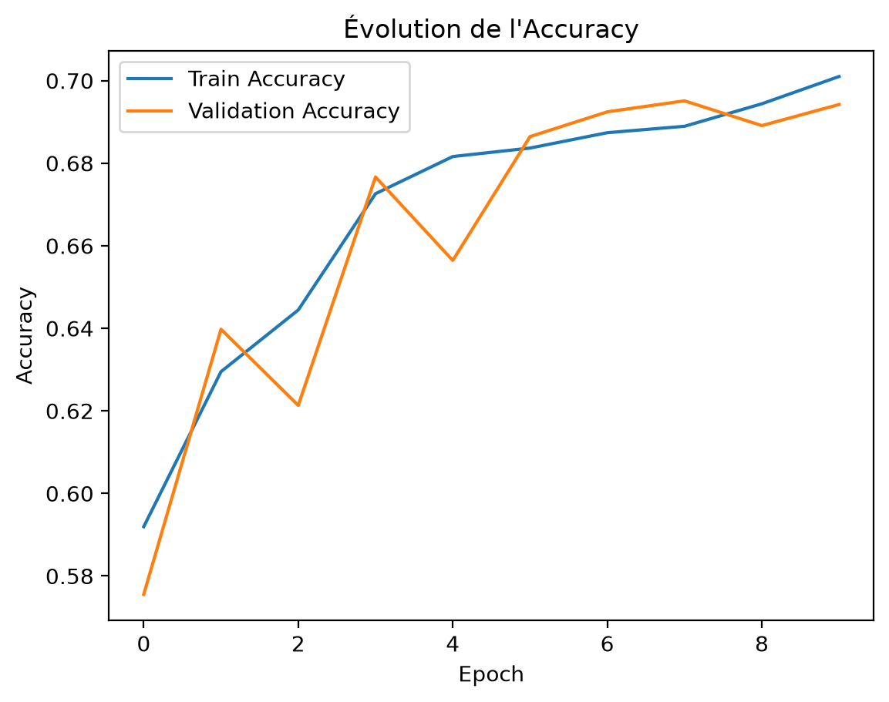
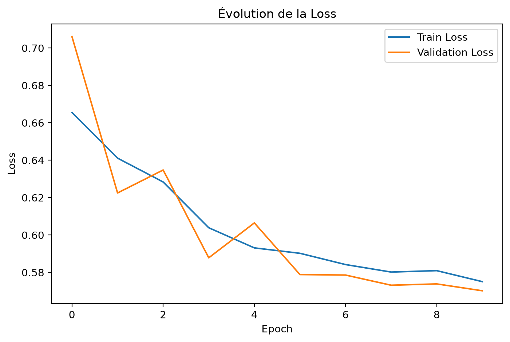
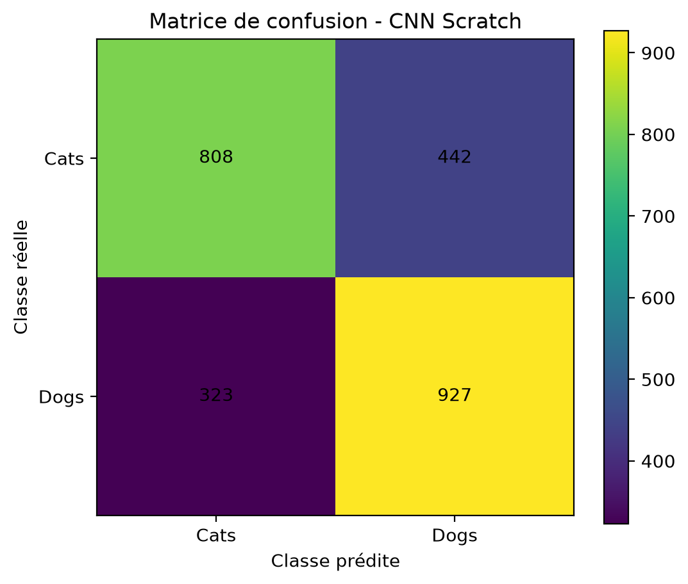

# CNN From Scratch vs Transfer Learning — Cats vs Dogs

## 1. Présentation du projet

Ce projet a été réalisé dans le cadre du cours **Deep Learning 1** du Master Intelligence Artificielle.

L'objectif est de développer et de comparer deux approches de classification d'images sur le jeu de données **Cats vs Dogs** avec **PyTorch** :

1. un réseau de neurones convolutif développé **from scratch** ;
2. une approche de **Transfer Learning** basée sur **ResNet18 pré-entraîné sur ImageNet**.

Pour chaque approche, deux optimiseurs sont étudiés :

* Adam ;
* SGD avec momentum.

Les expériences permettent d'étudier l'influence de l'architecture et de l'optimiseur sur l'apprentissage et les performances de classification.

Les principales métriques suivies sont :

* Loss ;
* Accuracy ;
* Precision ;
* Recall.

Des courbes d'apprentissage et des matrices de confusion sont également utilisées pour analyser les résultats.

---

# 2. Objectifs

Les objectifs du projet sont les suivants :

* construire un CNN avec au moins trois blocs convolutionnels ;
* utiliser Batch Normalization et Dropout pour régulariser le modèle ;
* entraîner le CNN from scratch ;
* utiliser ResNet18 pré-entraîné sur ImageNet ;
* adapter la dernière couche de ResNet18 à la classification Cats vs Dogs ;
* comparer Adam et SGD ;
* utiliser un scheduler pour adapter le learning rate ;
* sauvegarder les meilleurs modèles sous forme de checkpoints `.pth` ;
* recharger les meilleurs modèles pour l'évaluation finale ;
* comparer les performances des différentes configurations.

---

# 3. Environnement

## 3.1 Technologies utilisées

Le projet utilise :

* Python 3.12 ;
* PyTorch ;
* Torchvision ;
* NumPy ;
* Matplotlib ;
* Scikit-learn ;
* Pandas ;
* Jupyter Notebook ;
* Google Colab / GPU CUDA lorsque disponible.

## 3.2 Installation

Les dépendances nécessaires sont regroupées dans le fichier :

```text
requirements.txt
```

Pour installer les dépendances :

```bash
pip install -r requirements.txt
```

---

# 4. Utilisation du GPU

Le programme détecte automatiquement le périphérique disponible :

```python
device = torch.device(
    "cuda" if torch.cuda.is_available() else "cpu"
)

print("Device utilisé :", device)
```

Si un GPU CUDA est disponible, les modèles sont entraînés sur GPU.

Sinon, l'entraînement est effectué sur CPU.

---

# 5. Organisation du projet

L'arborescence actuelle du projet est :

```text
.
│
├── .gitignore
├── README.md
├── requirements.txt
├── notebook.ipynb
│
├── base_history_metriques_adam_train_val.xlsx
├── base_history_metriques_sgd_train_val.xlsx
├── base_history_metriques_tl_adam_train_val.xlsx
├── base_history_metriques_tl_sgd_train_val.xlsx
│
├── checkpoints/
│   ├── resnet18_best_adam.pth
│   ├── resnet18_best_sgd.pth
│   ├── resnet18_last_adam.pth
│   ├── resnet18_last_sgd.pth
│   ├── scratch_cnn_best_adam.pth
│   ├── scratch_cnn_best_sgd.pth
│   ├── scratch_cnn_last_adam.pth
│   └── scratch_cnn_last_sgd.pth
│
├── data/
│   ├── train/
│   │   ├── cat/
│   │   └── dog/
│   │
│   └── test/
│       ├── cat/
│       └── dog/
│
├── figures/
│   ├── evaluation_accuracy_cnn.png
│   ├── evaluation_accuracy_cnn_tl.png
│   ├── evaluation_loss_cnn.png
│   ├── evaluation_loss_cnn_tl.png
│   └── matrice_confusion_cnn.png
│
├── runs/
│   ├── cnn_from_scratch/
│   └── cnn_from_scratch_sgd/
│
└── __pycache__/
```

Le fichier principal contenant les expérimentations est :

```text
notebook.ipynb
```

---

# 6. Organisation des données

Les données sont placées dans le dossier :

```text
data/
```

avec l'organisation suivante :

```text
data/
├── train/
│   ├── cat/
│   └── dog/
│
└── test/
    ├── cat/
    └── dog/
```

Le jeu de données est chargé avec `ImageFolder`.

Les classes sont automatiquement identifiées :

```text
cat → 0
dog → 1
```

---

# 7. Configuration des chemins

Les chemins du projet sont définis automatiquement à partir du répertoire courant :

```python
import os

BASE_DIR = os.getcwd()

DATA_DIR = os.path.join(
    BASE_DIR,
    "data"
)

CHECKPOINT_DIR = os.path.join(
    BASE_DIR,
    "checkpoints"
)

FIGURES_DIR = os.path.join(
    BASE_DIR,
    "figures"
)

os.makedirs(
    CHECKPOINT_DIR,
    exist_ok=True
)

os.makedirs(
    FIGURES_DIR,
    exist_ok=True
)

print("Projet :", BASE_DIR)
print("Données :", DATA_DIR)
print("Checkpoints :", CHECKPOINT_DIR)
print("Figures :", FIGURES_DIR)
```

Cette organisation permet d'éviter d'utiliser des chemins absolus dépendant de l'ordinateur utilisé.

---

# 8. Jeu de données

Le jeu de données contient :

| Ensemble      | Nombre d'images |
| ------------- | --------------: |
| Train initial |          18 008 |
| Train         |          14 406 |
| Validation    |           3 602 |
| Test          |           2 500 |

Le jeu d'entraînement est divisé en :

* 80 % pour l'entraînement ;
* 20 % pour la validation.

Le jeu de test est conservé séparément et n'est pas utilisé pendant l'entraînement.

Le même découpage est utilisé pour :

* CNN from scratch ;
* CNN avec Adam ;
* CNN avec SGD ;
* Transfer Learning avec Adam ;
* Transfer Learning avec SGD.

Cela permet de comparer les expériences dans des conditions identiques.

---

# 9. Reproductibilité

Une graine aléatoire fixe est utilisée :

```python
SEED = 42

torch.manual_seed(SEED)
np.random.seed(SEED)

if torch.cuda.is_available():
    torch.cuda.manual_seed_all(SEED)
```

Le découpage entraînement/validation utilise également cette graine :

```python
split_generator = torch.Generator().manual_seed(SEED)

indices = torch.randperm(
    len(full_train_aug),
    generator=split_generator
)
```

Cette configuration permet d'obtenir le même découpage des données lors des différentes expériences.

---

# 10. Prétraitement et augmentation

Les images sont redimensionnées à :

```text
224 × 224 pixels
```

Le batch utilisé est :

```text
32 images
```

## 10.1 Transformation pour l'entraînement

Les images utilisées pour l'entraînement subissent les transformations suivantes :

```python
train_transforms = transforms.Compose([
    transforms.RandomRotation(30),
    transforms.RandomResizedCrop(224),
    transforms.RandomHorizontalFlip(),
    transforms.ToTensor()
])
```

Les transformations permettent de créer des variations des images originales et de réduire le risque de surapprentissage.

## 10.2 Transformation pour la validation et le test

```python
val_test_transforms = transforms.Compose([
    transforms.Resize((224, 224)),
    transforms.ToTensor()
])
```

Aucune augmentation aléatoire n'est appliquée à la validation ou au test.

---

# 11. Normalisation pour le Transfer Learning

Pour ResNet18, une normalisation correspondant aux statistiques d'ImageNet est utilisée :

```python
IMAGENET_MEAN = [
    0.485,
    0.456,
    0.406
]

IMAGENET_STD = [
    0.229,
    0.224,
    0.225
]
```

Les transformations sont :

```python
train_transforms_tl = transforms.Compose([
    transforms.RandomRotation(30),
    transforms.RandomResizedCrop(224),
    transforms.RandomHorizontalFlip(),
    transforms.ToTensor(),
    transforms.Normalize(
        mean=IMAGENET_MEAN,
        std=IMAGENET_STD
    )
])
```

Pour la validation et le test :

```python
val_test_transforms_tl = transforms.Compose([
    transforms.Resize((224, 224)),
    transforms.ToTensor(),
    transforms.Normalize(
        mean=IMAGENET_MEAN,
        std=IMAGENET_STD
    )
])
```

Cette normalisation permet de conserver un prétraitement compatible avec celui utilisé lors du pré-entraînement de ResNet18 sur ImageNet.

---

# 12. Expérience 1 — CNN From Scratch

## 12.1 Architecture

Le modèle `ScratchCNN` est construit entièrement avec PyTorch.

Il comporte trois blocs convolutionnels :

```text
Input
  │
  ▼
Conv2D 3 → 32
BatchNorm
ReLU
MaxPooling
  │
  ▼
Conv2D 32 → 64
BatchNorm
ReLU
MaxPooling
  │
  ▼
Conv2D 64 → 128
BatchNorm
ReLU
MaxPooling
  │
  ▼
Adaptive Average Pooling
  │
  ▼
Linear 128 → 256
ReLU
Dropout 0.5
  │
  ▼
Linear 256 → 2
  │
  ▼
Cat / Dog
```

Cette architecture respecte la contrainte d'avoir au minimum trois blocs convolutionnels.

---

# 13. Régularisation du CNN

Deux techniques de régularisation sont utilisées.

## Batch Normalization

Chaque bloc convolutionnel utilise une couche Batch Normalization.

```python
nn.BatchNorm2d(...)
```

Elle permet notamment de stabiliser l'apprentissage et d'améliorer la convergence.

## Dropout

Une couche Dropout de taux 0.5 est utilisée avant la dernière couche :

```python
nn.Dropout(0.5)
```

Elle permet de réduire le risque de surapprentissage.

---

# 14. Paramètres du CNN

Les principaux paramètres utilisés sont :

| Paramètre           |           Valeur |
| ------------------- | ---------------: |
| Architecture        |       ScratchCNN |
| Image size          |        224 × 224 |
| Batch size          |               32 |
| Epochs              |               10 |
| Dropout             |              0.5 |
| Batch Normalization |              Oui |
| Loss                | CrossEntropyLoss |
| Seed                |               42 |
| Scheduler           |           StepLR |
| Step size           |                3 |
| Gamma               |              0.1 |

Deux expériences sont réalisées avec le CNN :

* CNN + Adam ;
* CNN + SGD.

---

# 15. Optimisation du CNN

## 15.1 Adam

```python
optimizer_adam = optim.Adam(
    model.parameters(),
    lr=0.001
)
```

Configuration :

```text
Learning rate = 0.001
```

## 15.2 SGD

```python
optimizer_sgd = optim.SGD(
    model.parameters(),
    lr=0.01,
    momentum=0.9
)
```

Configuration :

```text
Learning rate = 0.01
Momentum = 0.9
```

---

# 16. Scheduler

Le scheduler utilisé est `StepLR` :

```python
scheduler = optim.lr_scheduler.StepLR(
    optimizer,
    step_size=3,
    gamma=0.1
)
```

Le learning rate est réduit d'un facteur 10 tous les trois epochs.

---

# 17. Fonction de perte

La fonction de perte utilisée est :

```python
criterion = nn.CrossEntropyLoss()
```

Elle est adaptée à la classification des deux classes :

```text
cat
dog
```

La même fonction de perte est utilisée pour le CNN et le Transfer Learning.

---

# 18. Expérience 2 — Transfer Learning

## 18.1 ResNet18

Le deuxième modèle est basé sur ResNet18 pré-entraîné sur ImageNet :

```python
model_tl = models.resnet18(
    weights=models.ResNet18_Weights.DEFAULT
)
```

Le pré-entraînement permet d'exploiter des représentations visuelles apprises sur ImageNet.

---

# 19. Adaptation de ResNet18

La couche de classification originale est remplacée par une nouvelle tête :

```python
n_features = model_tl.fc.in_features

model_tl.fc = nn.Sequential(
    nn.BatchNorm1d(n_features),
    nn.Dropout(0.5),
    nn.Linear(n_features, 2)
)
```

La nouvelle architecture de classification est :

```text
ResNet18
    │
    ▼
512 features
    │
    ▼
BatchNorm1d
    │
    ▼
Dropout 0.5
    │
    ▼
Linear 512 → 2
    │
    ▼
Cat / Dog
```

---

# 20. Stratégie de Transfer Learning

Le backbone ResNet18 est gelé :

```python
for param in model_tl.parameters():
    param.requires_grad = False
```

Seule la nouvelle tête de classification est entraînée :

```python
for param in model_tl.fc.parameters():
    param.requires_grad = True
```

Il s'agit donc d'un **Transfer Learning avec backbone gelé**.

Aucun fine-tuning du backbone n'est effectué dans cette expérimentation.

---

# 21. Paramètres du Transfer Learning

| Paramètre           |           Valeur |
| ------------------- | ---------------: |
| Modèle              |         ResNet18 |
| Poids               |         ImageNet |
| Backbone            |             Gelé |
| Image size          |        224 × 224 |
| Batch size          |               32 |
| Epochs              |               10 |
| Dropout             |              0.5 |
| Batch Normalization |              Oui |
| Loss                | CrossEntropyLoss |
| Seed                |               42 |
| Scheduler           |           StepLR |
| Step size           |                3 |
| Gamma               |              0.1 |

Deux expériences sont réalisées :

* ResNet18 + Adam ;
* ResNet18 + SGD.

---

# 22. Optimisation du Transfer Learning

## 22.1 Adam

```python
optimizer_tl = optim.Adam(
    filter(
        lambda p: p.requires_grad,
        model_tl.parameters()
    ),
    lr=0.001
)
```

## 22.2 SGD

Pour comparer correctement SGD à Adam, un nouveau ResNet18 pré-entraîné est initialisé :

```python
model_tl_sgd = models.resnet18(
    weights=models.ResNet18_Weights.DEFAULT
)
```

La tête de classification est ensuite remplacée et le backbone est gelé.

L'optimiseur SGD est :

```python
optimizer_tl_sgd = optim.SGD(
    filter(
        lambda p: p.requires_grad,
        model_tl_sgd.parameters()
    ),
    lr=0.01,
    momentum=0.9
)
```

Les deux expériences partent donc de poids ResNet18 pré-entraînés et indépendants.

---

# 23. Résumé des quatre expériences

| Expérience | Modèle     | Optimiseur |    LR | Momentum |
| ---------- | ---------- | ---------- | ----: | -------: |
| CNN Adam   | ScratchCNN | Adam       | 0.001 |        — |
| CNN SGD    | ScratchCNN | SGD        |  0.01 |      0.9 |
| TL Adam    | ResNet18   | Adam       | 0.001 |        — |
| TL SGD     | ResNet18   | SGD        |  0.01 |      0.9 |

Paramètres communs :

| Paramètre  | Valeur |
| ---------- | -----: |
| Batch size |     32 |
| Epochs     |     10 |
| Dropout    |    0.5 |
| BatchNorm  |    Oui |
| Scheduler  | StepLR |
| Step size  |      3 |
| Gamma      |    0.1 |
| Seed       |     42 |

---

# 24. Entraînement

Le processus d'entraînement suit les étapes suivantes :

```text
TRAIN
  │
  ▼
Calcul Loss + Accuracy
  │
  ▼
VALIDATION
  │
  ▼
Calcul Loss + Accuracy + Precision + Recall
  │
  ▼
Comparaison avec le meilleur modèle
  │
  ├── Meilleure Validation Accuracy
  │        │
  │        ▼
  │     BEST.pth
  │
  └── Dernier état
           │
           ▼
        LAST.pth
```

Les métriques sont enregistrées à chaque epoch.

Les historiques des différentes expériences sont également exportés dans des fichiers Excel.

---

# 25. Historiques des métriques

Les historiques sont sauvegardés dans quatre fichiers Excel :

```text
base_history_metriques_adam_train_val.xlsx
```

pour le CNN avec Adam.

```text
base_history_metriques_sgd_train_val.xlsx
```

pour le CNN avec SGD.

```text
base_history_metriques_tl_adam_train_val.xlsx
```

pour le Transfer Learning avec Adam.

```text
base_history_metriques_tl_sgd_train_val.xlsx
```

pour le Transfer Learning avec SGD.

Ces fichiers permettent de conserver les métriques obtenues pendant les différentes phases d'entraînement et de validation.

---

# 26. Checkpoints

Les modèles sont sauvegardés dans :

```text
checkpoints/
```

L'organisation actuelle est :

```text
checkpoints/
├── resnet18_best_adam.pth
├── resnet18_best_sgd.pth
├── resnet18_last_adam.pth
├── resnet18_last_sgd.pth
├── scratch_cnn_best_adam.pth
├── scratch_cnn_best_sgd.pth
├── scratch_cnn_last_adam.pth
└── scratch_cnn_last_sgd.pth
```

## Signification des fichiers

`best` :

> modèle ayant obtenu la meilleure performance sur la validation.

`last` :

> dernier état sauvegardé pendant l'entraînement.

Les checkpoints permettent également de reprendre l'entraînement après une interruption.

---

# 27. Rechargement des modèles

## CNN avec Adam

```python
checkpoint = torch.load(
    "checkpoints/scratch_cnn_best_adam.pth",
    map_location=device
)

model.load_state_dict(
    checkpoint["model_state_dict"]
)
```

## CNN avec SGD

```python
checkpoint = torch.load(
    "checkpoints/scratch_cnn_best_sgd.pth",
    map_location=device
)

model.load_state_dict(
    checkpoint["model_state_dict"]
)
```

## ResNet18 avec Adam

```python
checkpoint = torch.load(
    "checkpoints/resnet18_best_adam.pth",
    map_location=device
)

model_tl.load_state_dict(
    checkpoint["model_state_dict"]
)
```

## ResNet18 avec SGD

```python
checkpoint = torch.load(
    "checkpoints/resnet18_best_sgd.pth",
    map_location=device
)

model_tl_sgd.load_state_dict(
    checkpoint["model_state_dict"]
)
```

Après le rechargement, les modèles sont placés en mode évaluation :

```python
model.eval()
```

---

# 28. Évaluation

L'évaluation finale est effectuée sur les 2 500 images du jeu de test.

Les métriques calculées sont :

* Loss ;
* Accuracy ;
* Precision ;
* Recall ;
* matrice de confusion.

Les modèles utilisés pour l'évaluation finale sont les checkpoints `best`.

Le jeu de test n'intervient pas dans l'apprentissage ni dans la sélection du meilleur modèle.

---

# 29. Figures

Les résultats graphiques sont enregistrés dans :

```text
figures/
```

Les figures actuellement disponibles sont :

```text
figures/
├── evaluation_accuracy_cnn.png
├── evaluation_accuracy_cnn_tl.png
├── evaluation_loss_cnn.png
├── evaluation_loss_cnn_tl.png
└── matrice_confusion_cnn.png
```

## Accuracy

### CNN



### Transfer Learning


---

## Loss

### CNN



### Transfer Learning


---

## Matrice de confusion



---

# 30. Résultats

Les performances finales des quatre expériences sont regroupées dans le tableau suivant.

| Modèle                     | Optimiseur |   Test Loss |    Accuracy |   Precision |      Recall |
| -------------------------- | ---------- | ----------: | ----------: | ----------: | ----------: |
| CNN From Scratch           | Adam       | À compléter | À compléter | À compléter | À compléter |
| CNN From Scratch           | SGD        | À compléter | À compléter | À compléter | À compléter |
| ResNet18 Transfer Learning | Adam       | À compléter | À compléter | À compléter | À compléter |
| ResNet18 Transfer Learning | SGD        | À compléter | À compléter | À compléter | À compléter |

Les valeurs doivent être renseignées à partir de l'évaluation finale des checkpoints `best`.

---

# 31. Analyse des résultats

Le CNN from scratch apprend directement les représentations visuelles à partir des images Cats vs Dogs. L'architecture utilise trois blocs convolutionnels ainsi que Batch Normalization et Dropout afin de stabiliser l'apprentissage et de limiter le surapprentissage. L'utilisation de l'augmentation des données permet également de fournir au modèle des variations des images originales.

Le Transfer Learning avec ResNet18 exploite des représentations déjà apprises sur ImageNet. Dans cette expérimentation, le backbone est gelé et seule la nouvelle tête de classification est entraînée. Cette stratégie permet de réduire le nombre de paramètres effectivement optimisés tout en bénéficiant des représentations apprises par le modèle pré-entraîné.

La comparaison entre Adam et SGD permet d'observer l'influence de l'optimiseur sur la convergence. Adam utilise un learning rate de 0.001 tandis que SGD utilise un learning rate de 0.01 avec un momentum de 0.9. Le scheduler StepLR réduit le learning rate tous les trois epochs. Les résultats finaux doivent être analysés conjointement avec les courbes de Loss, Accuracy, Precision et Recall afin d'observer non seulement la performance finale mais également le comportement des modèles pendant l'apprentissage.

---

# 32. Analyse du surapprentissage

Les courbes d'entraînement et de validation permettent d'identifier un éventuel surapprentissage.

Un écart important entre la performance d'entraînement et celle de validation peut indiquer que le modèle apprend trop spécifiquement les données d'entraînement.

De même, une diminution continue de la Training Loss accompagnée d'une augmentation de la Validation Loss peut être un signe de surapprentissage.

Plusieurs mécanismes sont utilisés dans ce projet pour limiter ce phénomène :

* Data Augmentation ;
* Batch Normalization ;
* Dropout ;
* validation ;
* sélection du meilleur checkpoint.

---

# 33. Comparaison des deux approches

| Critère                   | CNN From Scratch     | Transfer Learning |
| ------------------------- | -------------------- | ----------------- |
| Architecture              | CNN personnalisé     | ResNet18          |
| Pré-entraînement          | Non                  | ImageNet          |
| Représentations initiales | Apprises depuis zéro | Pré-apprises      |
| Backbone                  | —                    | ResNet18          |
| Backbone gelé             | —                    | Oui               |
| BatchNorm                 | Oui                  | Oui               |
| Dropout                   | 0.5                  | 0.5               |
| Data Augmentation         | Oui                  | Oui               |
| Normalisation ImageNet    | Non                  | Oui               |
| Optimiseurs               | Adam / SGD           | Adam / SGD        |
| Batch size                | 32                   | 32                |
| Epochs                    | 10                   | 10                |
| Scheduler                 | StepLR               | StepLR            |
| Loss                      | CrossEntropyLoss     | CrossEntropyLoss  |

---

# 34. Limites

Les principales limites de l'expérimentation sont :

* le nombre d'epochs est limité à 10 ;
* les hyperparamètres n'ont pas fait l'objet d'une recherche exhaustive ;
* seuls Adam et SGD sont comparés ;
* les valeurs de learning rate choisies ne sont pas nécessairement optimales ;
* un seul modèle pré-entraîné, ResNet18, est utilisé ;
* le backbone ResNet18 est gelé ;
* aucun fine-tuning progressif du backbone n'est effectué ;
* le jeu de données est limité à deux classes ;
* les performances peuvent dépendre des augmentations utilisées ;
* les résultats peuvent varier selon le matériel utilisé.

---

# 35. Pistes d'amélioration

Plusieurs améliorations peuvent être envisagées.

## 35.1 Recherche d'hyperparamètres

Tester différentes valeurs de :

* learning rate ;
* batch size ;
* dropout ;
* momentum ;
* nombre d'epochs.

Par exemple :

```text
Batch size :
32
64

Learning rate :
0.0001
0.001
0.01
```

## 35.2 Fine-tuning

Après l'entraînement de la nouvelle tête de ResNet18, certaines couches du backbone pourraient être dégelées progressivement afin d'adapter les représentations aux images Cats vs Dogs.

## 35.3 Autres architectures

Tester d'autres modèles pré-entraînés :

* ResNet50 ;
* MobileNet ;
* EfficientNet ;
* DenseNet.

## 35.4 Data Augmentation

Tester des transformations supplémentaires :

* ColorJitter ;
* RandomAffine ;
* RandomGrayscale ;
* RandomErasing.

## 35.5 Analyse des erreurs

Une analyse des images mal classées permettrait d'identifier les types d'images qui posent le plus de difficultés aux modèles.

---

# 36. Fichiers générés

Le projet produit plusieurs types de fichiers.

## Modèles

```text
checkpoints/*.pth
```

## Historiques des métriques

```text
*.xlsx
```

## Figures

```text
figures/*.png
```

## Logs

Les dossiers :

```text
runs/cnn_from_scratch/
runs/cnn_from_scratch_sgd/
```

contiennent les informations générées pendant les expérimentations correspondantes.

---

# 37. Versionnement

Les fichiers temporaires et certains fichiers volumineux ne doivent pas être versionnés.

Le fichier :

```text
.gitignore
```

est utilisé pour exclure notamment les fichiers qui ne sont pas nécessaires au dépôt GitHub, tels que les checkpoints ou les fichiers temporaires.

---

# 38. Auteur

**Sékou Dramé**

Master 1 — Intelligence Artificielle
Dakar Institute of Technology

Projet réalisé dans le cadre du cours **Deep Learning 1**.

---

# 39. Résumé des expériences

| Expérience | Modèle                     | Optimiseur |    LR | Batch | Epochs | Dropout | BatchNorm |
| ---------- | -------------------------- | ---------- | ----: | ----: | -----: | ------: | --------- |
| 1          | CNN From Scratch           | Adam       | 0.001 |    32 |     10 |     0.5 | Oui       |
| 2          | CNN From Scratch           | SGD        |  0.01 |    32 |     10 |     0.5 | Oui       |
| 3          | ResNet18 Transfer Learning | Adam       | 0.001 |    32 |     10 |     0.5 | Oui       |
| 4          | ResNet18 Transfer Learning | SGD        |  0.01 |    32 |     10 |     0.5 | Oui       |

Les quatre expériences utilisent le même découpage des données et la même graine aléatoire afin de faciliter la comparaison des performances.
